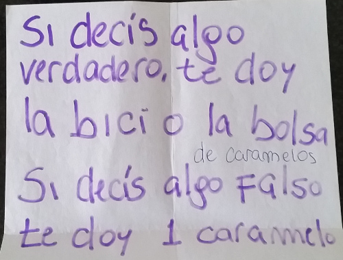
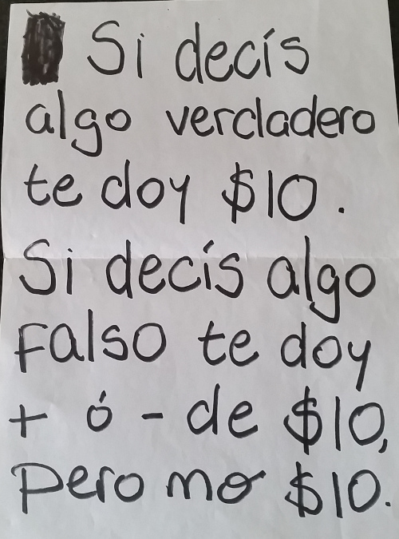
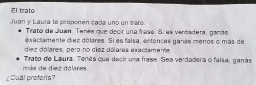
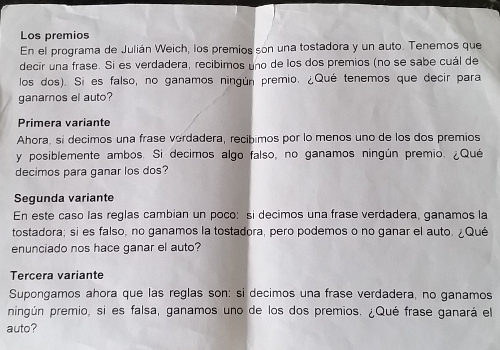
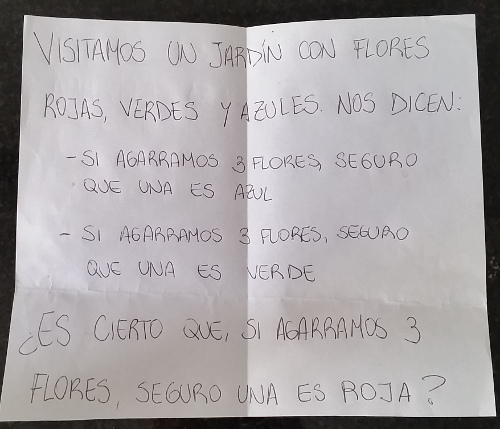
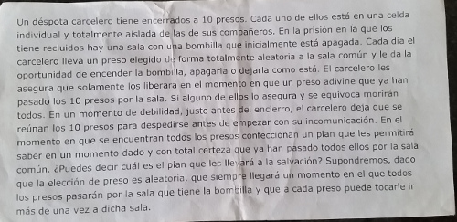

Stand de Lógica
==============

Semana de la Computación - 2016

DC - FCEyN - UBA

Sobre el stand
-------------------------

Índice
----------------

[1. Premios](#n1)
[2. Honestos y mentirosos](#n2)
[3. Confucio](#n3)
[4. Flores y piedras](#n4)
[5. El rey de Argentina](#n5)
[6. Verdadero o falso?](#n6)
[7. Culpables, inocentes y algas](#n7)
[8. Seleccione la respuesta correcta](#n8)
[9. Valores de verdad extraños](#n9)
[10. Todas las puertas mienten](#n10)
[11. El retrato de Porcia](#n11)
[12. El carcelero](#n12)

Números
----------------
<a name="n1"><h4> 1. Premios </h4></a>

<a name="n2"><h4> 2. Honestos y mentirosos </h4></a>

<a name="n3"><h4> 3. Confucio </h4></a>

<a name="n4"><h4> 4. Flores y piedras </h4></a>

<a name="n5"><h4> 5. El rey de Argentina </h4></a>

<a name="n6"><h4> 6. Verdadero o falso? </h4></a>

<a name="n7"><h4> 7. Culpables, inocentes y algas </h4></a>

<a name="n8"><h4> 8. Seleccione la respuesta correcta </h4></a>

<a name="n9"><h4> 9. Valores de verdad extraños </h4></a>

<a name="n10"><h4> 10. Todas las puertas mienten </h4></a>

<a name="n11"><h4> 11. El retrato de Porcia </h4></a>

<a name="n12"><h4> 12. El carcelero </h4></a>

