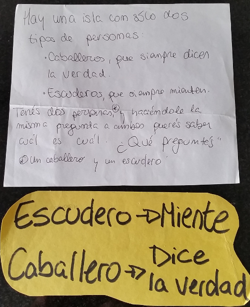
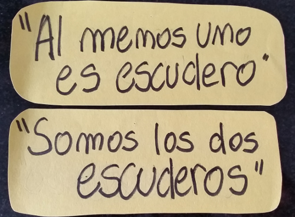

Honestos y mentirosos
=====================

Estos acertijos se tratan sobre una situación donde alguien siempre dice la verdad, y alguien siempre miente. En cada caso, queremos sacar algún tipo de información haciendo una pregunta que nos permita distinguir entre quién miente y quién es honesto.

El prisionero y los vigilantes
------------------------------

* Solución: "El otro vigilante me diría que tu puerta conduce a la libertad?" Si la respuesta es que no, cruzo la puerta. Sino, cruzo la otra puerta.

Caballeros y escuderos
----------------------

* Solución: "Al menos uno de ustedes es escudero?". El que dice que sí es caballero, el otro es escudero.

Alicia y el día de la semana
----------------------------

* Solución: Jueves. Por qué?

Isla Zombis
-----------

* Solución: ??
