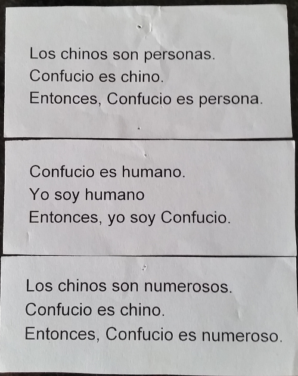

Confucio
========

Este número no es un acertijo, sino que es para pensar sobre la validez de la argumentación.

* El primer argumento y el tercero son sintácticamente equivalentes, pero uno tiene sentido y el otro no. Por qué?
* Por qué está mal el segundo argumento?
