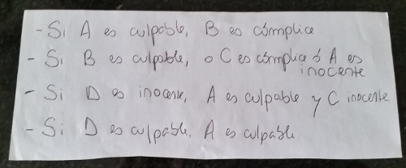

Culpables, inocentes y algas
============================

Quién es culpable?
------------------

* La pregunta es: si se cumplen estas condiciones, quiénes son culpables y quiénes son inocentes? Asumimos que ser cómplice significa ser culpable también.
* Solución: Por 3 y 4, vemos que A es culpable si D es culpable y también si D es inocente. Entonces, A tiene que ser culpable. Por 1, B también es culpable. Por 2, sabemos que C es culpable o A es inocente, pero como sabemos que A es culpable, entonces C también lo es. Por último, D también tiene que ser culpable, porque si no, por 3 sería C inocente. O sea, todos son culpables.

Las algas echan humo?
---------------------

* Solución: todo lo que echa humo, usa desodorante y, por lo tanto, sabe tocar el saxo. Las algas usan medias rojas y, por lo tanto, no pueden tocar el saxo. Entonces, las algas NO pueden echar humo.
