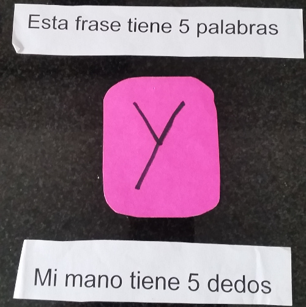
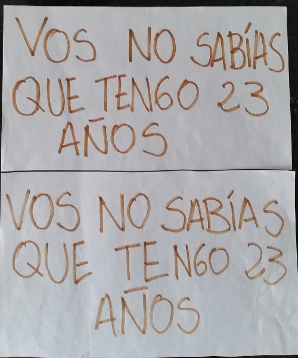
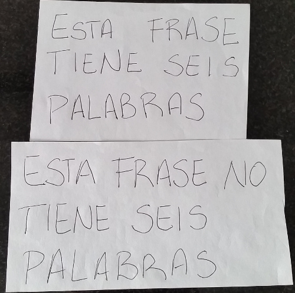

Valores de verdad extraños
==========================

Este número no es un acertijo, sino que es para presentar casos donde el valor de verdad de una proposición se comporta de forma extraña.

Palabras Y Dedos
----------------

* Presentando primero ambas frases independientemente, ambas son ciertas. Al unirlas con un Y, la frase pasa a ser falsa. Es decir, vale P y vale Q, pero no vale P && Q.

Vos no sabías que tengo 23 años
-------------------------------

* Las dos tarjetas dicen lo mismo; la gracia es que, cuando doy la primera la frase es cierta mientras que cuando doy la segunda, la frase (que es exactamente la misma proposición que antes) pasa a ser falsa.

Frase 6 Palabras
----------------

* La gracia está en pensar a la frase como una proposición. "Esta frase no tiene seis palabras" es falsa, pero al negarla sigue siendo falsa: "Esta frase tiene seis palabras".
