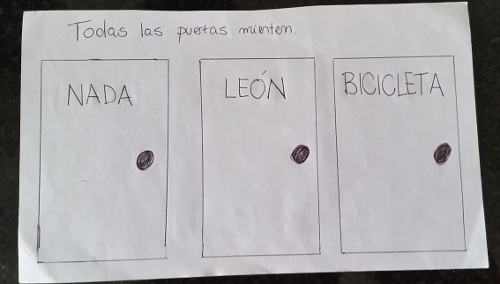

Todas las puertas mienten
=========================

* Cómo hago para obtener la bicicleta sin que me coma el león?
* Solución: Seguro que el león no está en el medio. Abro la del medio, si está la bicicleta ya gané. Sino, me quedan dos puertas (Nada, Bicicleta) para dos cosas (León, Bicicleta). Como sé que las puertas mienten, la bicicleta tiene que estar sí o sí en la puerta Nada.
* Después: qué pasa si las puertas pueden o no mentir?
