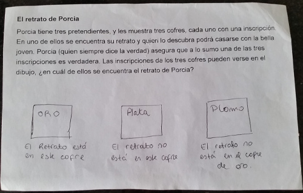

El retrato de Porcia
====================

* Ayuda: Entre Oro y Plomo, sí o sí una tiene que ser verdadera y la otra falsa (una es la negación de la otra).
* Solucion: Como a lo sumo una es verdadera, usando la ayuda puedo probar los dos casos, y el único que no lleva a una contradicción es cuando Plomo es verdadera.
