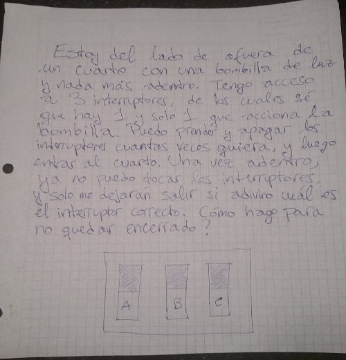

Bombillas de luz
================

Estos acertijos tienen que ver con bombillas de luz, y son los dos bastante complicados.

Los tres interruptores
----------------------

* Aclaraciones: la bombilla es una bombilla incandescente tradicional, y si así lo quiero, puedo entrar al cuarto inmediatamente después de accionar los interruptores.
* Ayuda: considerar a la bombilla no solo como un dispositivo que genera luz, sino también como uno que genera calor.
* Solución: prendo el interruptor A y espero varios minutos. Apago el interruptor A, y prendo el B. Entro rápidamente al cuarto: si la luz está encendida, el interruptor era el B. Si la luz está apagada, pero la bombilla está caliente, el interruptor correcto era el A. De lo contrario, era el C.

El carcelero
------------

